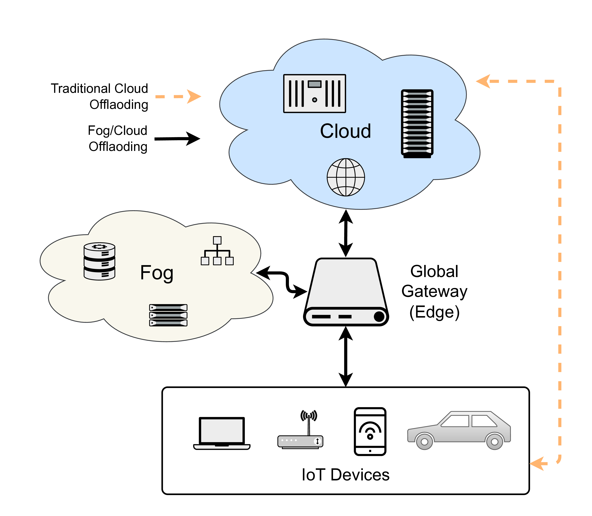
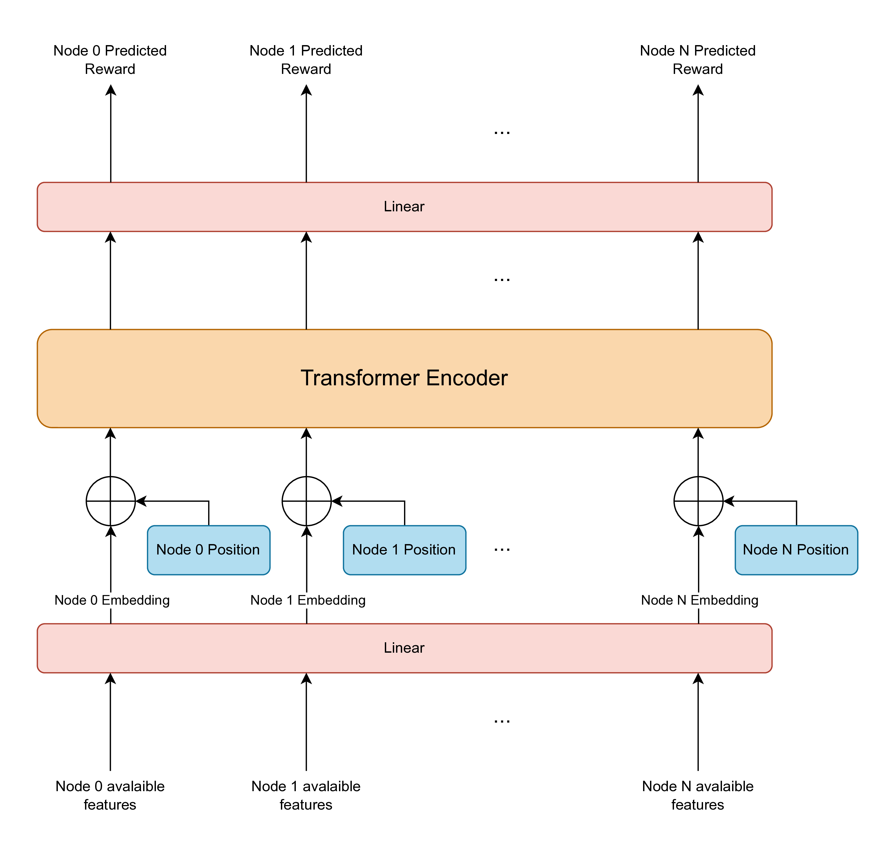
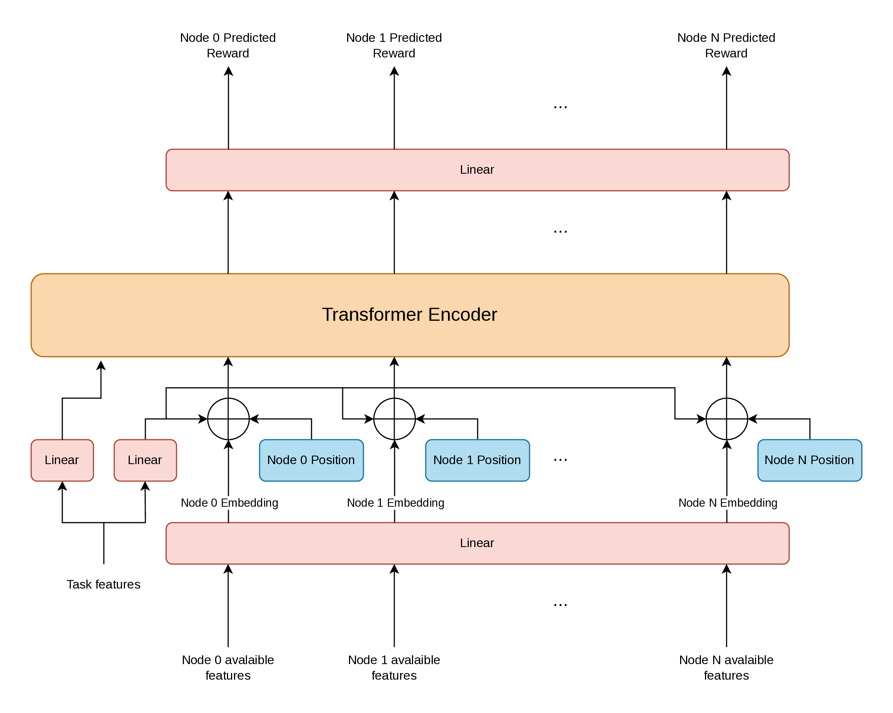

# NATE and T-NATE: Efficient Transformers for IoT Task Offloading

Official implementation of the paper **"NATE and T-NATE: Efficient transformers for IoT
task offloading in edge–fog–cloud computing"** (*Sustainable Computing: Informatics and
Systems*, 2026).

[](https://doi.org/10.1016/j.suscom.2026.101392)
[](LICENSE)
[](https://www.python.org/)

📄 **Paper:** <https://www.sciencedirect.com/science/article/pii/S2210537926001022>

A research framework for **learning and benchmarking task-offloading policies** in fog/edge
computing. It simulates streams of IoT tasks executing across a network of edge, fog, and
cloud nodes with a SimPy-based discrete-event engine, and trains a range of policies —
Transformer and MLP Deep Q-Learning, genetic algorithms, and classic heuristics — to optimise
the multi-objective trade-off between **task drop rate**, **latency**, and **energy**. It is
built on top of [RayCloudSim](https://github.com/ZhangRui111/RayCloudSim).

---

## Problem & method

Each incoming task arriving at the global gateway must be assigned to one of `N` nodes (the
gateway itself, a fog node, or a cloud node) — a **fine-grained node-selection** action space,
rather than the binary "edge vs. cloud" choice common in prior work. Decisions are driven by a
multi-objective reward combining task drop rate (TDR), latency, and energy, weighted by
`(λ₀, λ₁, λ₂)`.

<p align="center">
  
</p>

The two proposed architectures are Transformer-based Q-networks:

- **NATE** — *Node-Aware Transformer Encoder.* Encodes each node's resource state (CPU,
  buffer, up/down bandwidth) and uses multi-head self-attention to capture inter-node
  interdependencies before estimating a Q-value per node.
- **T-NATE** — *Task-and-Node-Aware Transformer Encoder.* Extends NATE by additionally
  conditioning on per-task attributes (size, CPU cycles/bit, deadline, bit rate) via additive
  conditioning plus a learned prefix token.

These are compared against MLP / T-MLP Q-networks, an NSGA-II / NPGA neuroevolution baseline,
and Random / Greedy / Round-Robin heuristics, across three topologies of increasing scale.

<p align="center">
  
  &nbsp;&nbsp;
  
</p>
<p align="center"><em>NATE (left) encodes node resources; T-NATE (right) additionally conditions on task attributes.</em></p>

---

## Results

Performance across the three topologies, mean ± std over **8 runs**. **Bold** = best,
*italic* = second-best per row. `Baseline` is the Greedy (cpu) reference heuristic; the
composite score `S` is normalised so that `S = 1.0` matches that heuristic on Pakistan (8N)
(lower is better for `S`, `L`, `E`, `TDR`).

| Topology | Metric | Baseline | NSGA-II | MLP | NATE | T-MLP | T-NATE |
|----------|--------|---------:|--------:|----:|-----:|------:|-------:|
| **Pakistan (8N)**  | TDR (%) | 0.19  | 0.00±0.00      | 0.00±0.00         | 0.00±0.00            | 0.00±0.00          | 0.00±0.00 |
|                    | L (s)   | 4.394 | 3.618±0.165    | 3.715±0.074       | 3.779±0.123         | **2.906±0.026**    | *3.012±0.083* |
|                    | E (W)   | 260.5 | 260.4±6.6      | 215.3±4.5         | 207.5±6.6           | *170.7±2.4*        | **162.3±3.7** |
|                    | S       | 1.0   | 0.608±0.004    | 0.557±0.002       | 0.552±0.001         | *0.439±0.003*      | **0.436±0.003** |
| **Pakistan (20N)** | TDR (%) | 36.92 | 11.89±10.38    | 0.00±0.00         | 0.00±0.00           | 0.00±0.00          | 0.00±0.00 |
|                    | L (s)   | 4.884 | 11.034±1.536   | 3.748±0.050       | 3.832±0.051         | *3.235±0.026*      | **3.016±0.018** |
|                    | E (W)   | 364.9 | 293.9±3.9      | 237.5±2.8         | 226.8±2.1           | **182.1±1.1**      | *185.7±2.6* |
|                    | S       | 65.52 | 1.423±0.288    | 0.588±0.001       | 0.581±0.002         | *0.478±0.001*      | **0.466±0.003** |
| **Synth (50N)**    | TDR (%) | 56.74 | 44.45±3.86     | 0.2879±0.1842     | *0.0083±0.0088*     | 0.167±0.0135       | **0.0017±0.0029** |
|                    | L (s)   | 4.456 | 16.07±3.82     | 5.742±0.370       | 5.033±0.074         | *4.906±0.099*      | **4.496±0.056** |
|                    | E (W)   | 364.9 | 318.7±33.0     | 277.5±2.1         | 269.3±2.4           | *189.1±2.5*        | **185.5±2.1** |
|                    | S       | 100.3 | 80.07±6.82     | 1.299±0.330       | 0.741±0.019         | *0.643±0.026*      | **0.581±0.008** |

**Key findings.** T-NATE attains the best composite score at every scale while keeping the
task drop rate below 0.01 % even at 50 nodes. The advantage of attention is scale-dependent:
on Pakistan (8N) NATE/T-NATE match their MLP counterparts within ~1 % on `S`, but on Synthetic
(50N) NATE reduces `S` by **43 %** vs. MLP and T-NATE by **9.6 %** vs. T-MLP. NSGA-II is
competitive at 8/20 nodes but collapses at 50, and heuristics become impractical at scale
(TDR 36–57 %).

See [`docs/REPRODUCE.md`](docs/REPRODUCE.md) to regenerate this table.

---

## Requirements & Installation

Requires **Python ≥ 3.8** (developed and tested on 3.12).

```bash
conda create --name fog python=3.12
conda activate fog
pip install -r requirements.txt
```

Main dependencies: `networkx`, `simpy`, `numpy`, `pandas`, `torch`, `matplotlib`, `seaborn`,
`plotly`, `optuna` (+ `optuna-dashboard`), `scipy`, `tqdm`, `PyYAML`. See
[`requirements.txt`](requirements.txt) for the pinned versions. Runs on CPU or CUDA GPU; no GPU
is required.

---

## Quick start

Everything runs through [`main.py`](main.py), which is driven by a single YAML config file:

```bash
python main.py configs/Pakistan/Tuple100K/DQL/NATE.yaml
```

A config selects the policy, the dataset/scenario, and all training/evaluation
hyperparameters. Training runs through epochs (or generations, for GA) with validation-based
early stopping, then evaluates on the held-out test set. Logs, metrics (CSV), checkpoints, and
plots are written under `logs/<dataset>/<flag>/<policy>/<timestamp>/`.

---

## Policies

Policies are registered in [`policies/__init__.py`](policies/__init__.py) and selected via the
`policy:` field in the config. Available policies:

| Key | Family | Description |
|-----|--------|-------------|
| `Random` | Heuristic | Offload to a uniformly random node. |
| `Greedy` | Heuristic | Offload to the node with the most available resources. |
| `RoundRobin` | Heuristic | Offload to nodes in round-robin order. |
| `MLP` / `T-MLP` | DQL | MLP Q-network; `T-` adds per-task input features. |
| `NATE` | DQL | **Node-Aware** Transformer Encoder. |
| `T-NATE` | DQL | **Task-and-Node-Aware** Transformer Encoder. |
| `CT-NATE` | DQL | Conditional NATE variant (task-modulated). |
| `NPGA` | GA | Niched Pareto Genetic Algorithm. |
| `NSGA2` | GA | Non-dominated Sorting Genetic Algorithm II (NSGA-II). |

The neural architectures live in [`policies/model/`](policies/model); the training logic for
each family is in `utils/dql.py` (DQL) and `utils/GA.py` (GA).

---

## Datasets & configs

Configs are organised as `configs/<dataset>/<flag>/<family>/<policy>.yaml`. The three scenarios
evaluated in the paper:

| Scenario | Nodes | Task density | `dataset` / `flag` |
|----------|-------|--------------|--------------------|
| Pakistan (8N)   | 8  (1 edge, 5 fog, 2 cloud)   | 60 tasks/s/node  | `Pakistan` / `Tuple30K` |
| Pakistan (20N)  | 20 (1 edge, 14 fog, 5 cloud)  | 80 tasks/s/node  | `Pakistan` / `Tuple100K` |
| Synthetic (50N) | 50 (1 edge, 35 fog, 14 cloud) | 150 tasks/s/node | `Synthetic` / `50N100T150D` |

The Pakistan scenarios use a real IoT task trace collected in Islamabad. Additional configs
(`Tuple50K`, `Synthetic/100N100T180D`, `Topo4MEC`) are bundled but out of scope for the paper.
Each config sets the `policy`, the `env` (dataset/flag/refresh rate), the `eval.lambda`
multi-objective weights, and the `training`/`model` hyperparameters.

---

## Advanced usage

### Hyperparameter search

Search over any config field with `--search "section.key=v1,v2,..."`:

```bash
python main.py configs/Pakistan/Tuple100K/DQL/T-NATE.yaml \
    --search "training.lr=1e-4,5e-5,2e-5" "training.batch_size=16,32,64" \
    --sampler qmc --n_samples 32 --num_workers 4 --device cuda
```

- `--sampler {grid,random,qmc}` — search strategy (`grid` = all combinations, `random` =
  uniform, `qmc` = Sobol low-discrepancy). Default: `random`.
- `--n_samples N` — number of trials (ignored for `grid`).
- `--num_workers N` — parallel worker processes (GPUs assigned round-robin).

Searches are resumable and backed by Optuna. See
[`docs/hparam_search.md`](docs/hparam_search.md) for the design.

> **Reproducing the paper.** [`docs/REPRODUCE.md`](docs/REPRODUCE.md) maps every
> table and figure to its config and command, including the scenario → config
> mapping (Pakistan 8N/20N, Synthetic 50N).

### Multi-seed evaluation

Report aggregate mean ± std over several seeds (resumable — completed seeds are skipped):

```bash
python main.py configs/Pakistan/Tuple100K/DQL/NATE.yaml --seeds 42 123 456
python main.py configs/Pakistan/Tuple100K/DQL/NATE.yaml --n_seeds 8   # shortcut for seeds 0..7
```

### Plotting from existing results

```bash
python main.py configs/.../some.yaml --plot lambda   # ternary plots from a lambda search
```

Standalone plotting/benchmarking scripts also live in [`utils/`](utils) (run from the repo
root), e.g. `python utils/benchmark_inference.py <config.yaml>` to benchmark `policy.act()`
inference speed.

---

## Project structure

```
core/            Discrete-event simulator: tasks, environment, infrastructure, logging
  vis/           Post-simulation visualisation
policies/        Offloading policies
  heuristics/    Random, Greedy, RoundRobin
  dql/           Deep Q-learning policies (MLP, NATE, CT-NATE)
  ga/            Genetic-algorithm policies (NSGA-II, NPGA)
  model/         Neural network architectures
eval/            Benchmark datasets and metrics
configs/         YAML run configs, grouped by dataset / flag / family
utils/           Training loops, hyperparameter search, plotting & benchmarking scripts
docs/            Additional documentation (hparam search, reproduction guide)
main.py          Single entry point for training / search / evaluation
```

---

## Citation

If you use this framework, please cite the paper:

```bibtex
@article{GARON2026101392,
  title   = {NATE and T-NATE: Efficient transformers for IoT task offloading in edge--fog--cloud computing},
  author  = {Arthur Garon and Sonia Yassa and Lylia Alouache},
  journal = {Sustainable Computing: Informatics and Systems},
  volume  = {51},
  pages   = {101392},
  year    = {2026},
  issn    = {2210-5379},
  doi     = {10.1016/j.suscom.2026.101392},
  url     = {https://www.sciencedirect.com/science/article/pii/S2210537926001022}
}
```

A machine-readable [`CITATION.cff`](CITATION.cff) is also provided.

---

## License & credits

Released under the [MIT License](LICENSE).

This framework is based on [RayCloudSim](https://github.com/ZhangRui111/RayCloudSim) — refer to
the original repository for details on the simulation environment.

Developed and maintained by **Arthur Garon** as part of his research project. Questions and
contributions are welcome — please open an issue or pull request.
